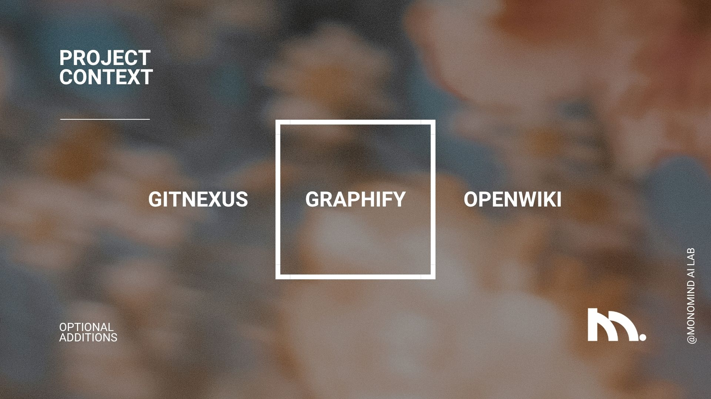

# Project Context

<p align="left">
  
</p>

> **Shared project context that outlives any one person, agent, or chat.**

Project Context builds a context pipeline right into a repository or project
folder. As work produces evidence, milestones promote the current state, durable
decisions, and verified learnings into small Markdown files—Git-tracked when
version control is available. Unlike chat history, proprietary memory, or
generated documentation, that context stays portable across collaborators and
tools—and remains owned by the project.

Everything lives in the project's own repository, in ordinary Markdown that Git
can review. Markdown and Git are the whole storage contract:
no database, vector store, or server is required, and no command reaches the
network.

Project Context works with software, document, research, writing, and mixed
projects.

Project Context is **agent-operated and human-readable**. People provide intent,
answer onboarding and opt-in questions, and approve proposed changes. Agents
read the skills and Markdown instructions, run the tooling, maintain the context
files, and verify the result. Humans can review or edit the Markdown at any time,
but they are not expected to invoke skills or run Python commands themselves.

Running several repositories and want one place to hold what applies across all
of them? That is the other half of the pair,
**[Project Hub](https://github.com/monomind-ai-lab/project-hub)** — optional, and
[explained below](#project-hub--the-other-half-and-entirely-optional). A single
repository needs nothing but what is on this page.


---

## 🚀 Quick Start (30 Seconds)

Two ways in — one command if you have Python tooling, one pasted prompt if you
have nothing but an AI agent. Both preview the exact plan before writing.

### Single-command install (recommended)

With `uvx` or `pipx`:

```sh
uvx --from git+https://github.com/monomind-ai-lab/project-context project-context init --target . --install-skills --apply
```

Or install once and reuse:

```sh
pipx install git+https://github.com/monomind-ai-lab/project-context
project-context init --target . --install-skills --apply
```

The CLI is deterministic: swap `--apply` for `--dry-run` to preview the exact
file plan first. Zero runtime dependencies — stdlib Python 3.10+. Subcommands:
`init`, `update`, `capture`, `inspect`, `context`, `onboard`, `review`, `consolidate`, `doctor`.

### Agent-guided install

**No skill launcher, Python tooling, or manual setup required** — your AI agent
does the work, asks the onboarding question, and shows you the plan for
approval. Paste this prompt into any AI agent that can read and edit your
target repository or project folder:

```text
Install Project Context in the current repository or project folder using
https://github.com/monomind-ai-lab/project-context. Read and follow
`skills/project-context-init/SKILL.md`, starting with its required onboarding
question. Show me the proposed plan and wait for my approval before making changes.
```

The agent starts by asking whether the repository is brand-new, then adapts the
pipeline to software, documents, research, writing, mixed, or general work.
Before writing anything, it proposes the profile, the exact file changes, and any
relevant optional tools, and waits for your approval.

- **[Standalone installation prompt](prompts/install-project-context.md)** — an
  easy-to-copy version of the prompt above. The full behavior stays in the skill
  so the prompt does not drift or duplicate instructions.
- **[Maintenance prompt](prompts/maintain-project-context.md)** — use the
  pipeline after installation, including with agents that do not support
  installed skills.


---

## 🏠 Where Context Lives

Context lives in the project it describes:

```text
<repository>/
├── AGENTS.md                      # managed <!-- project-context:start --> block
├── CLAUDE.md                      # the same block; install creates whichever is missing
└── project-context/
    ├── .project-context.json      # marker: schema, version, project id, pushed-set stamps
    ├── SKILL.md                   # the protocol, installed as this repository's instance
    ├── NOW.md                     # current state, active work, blockers, next action
    ├── DECISIONS.md               # the decision registry
    ├── LEARNINGS.md               # verified, reusable lessons
    ├── decisions/  tasks/         # detail records, full profile
    ├── designs/    incidents/     # supporting evidence, full profile
    ├── global/  blueprint/        # owner-authored, read-only, present only when pushed
    └── indexes/                   # derived tables, regenerated
```

Everything above the `global/` line is **authored** here: builders write it, and
it is the repository's own record of itself. `global/` and `blueprint/` are the
**pushed set** — owner-authored elsewhere, copied in, and read-only here. A
repository that has no owner pushing to it simply has neither folder and is a
complete, working, offline product without them.

### One record model

Every record obeys one contract, and one doctor enforces it in every place a
record can live:

- **One schema string**, `project-context/1`, recorded in the marker.
- **One version number per product**, read from that product's `VERSION`. The
  marker names the product that wrote it, because the two products ship on
  their own cadences and their numbers do not relate. `TEMPLATE_VERSION` and
  `SCAFFOLD_VERSION` are retired.
- **Six required frontmatter keys** on a detail record in `decisions/`,
  `questions/`, `tasks/`, or `inbox/` — `id`, `kind`, `status`, `title`,
  `created`, `asserted_by` — and nothing else required. Registries stay plain
  Markdown.
- **One lifecycle per kind**, enforced against that record's kind rather than a
  union: `decision`, `learning`, and `capsule` are `proposed` → `accepted` →
  `superseded` | `rejected`; a `question` is `open` → `answered` →
  `superseded`; a `task` is `proposed` → `active` → `done` | `dropped`.
  `candidate` and `approved` are retired everywhere, and the doctor says so
  where it finds them.
- **One reference grammar**, validated by shape and never by resolving it:
  `session:<harness>:<id>`, `commit:<binding>:<sha>`, `pr:<binding>#<number>`,
  `review:<binding>#<pr>/<comment-id>`, `ticket:<tracker>:<key>`,
  `doc:<binding>:<path>@<commit>`, `url:https://…`, `capsule:<id>`.
- **Stamps in the marker, never in the file.** A pushed file stays clean
  Markdown; the marker records its `sha256`, source commit, and push time, and
  the doctor reports a local edit as an error naming where the change belongs.

### Project Hub — the other half, and entirely optional

The pushed set arrives from **[Project Hub](https://github.com/monomind-ai-lab/project-hub)**,
the second product in this pair. Nothing here requires it: a repository with no
Hub has no `global/` and no `blueprint/`, and everything above still works
offline. Read on only if your organisation runs one, or you are deciding whether
to.

**Two products, split by role rather than by format.** Project Context is
installed in each project repository and serves the people building that
project. A Hub is one private repository the organisation's owner administers.
It authors the tier that applies everywhere — guardrails, workflows, shared
records — and keeps a folder per project. Both sides validate records with the
same parser, the same schema, and the same doctor, because a Hub is itself a
Project Context install; the shared code arrives there by the ordinary
create-only install rather than being vendored a second time.

**Everything moves by the owner's hand, and only in the direction their access
allows.**

| Direction | Command | Who runs it | What moves |
| --- | --- | --- | --- |
| Hub → repo | `project-hub push <repo>` | The owner | `global/` and `blueprint/` land in `project-context/`, stamped |
| Repo → Hub | `project-hub pull <repo>` | The owner | The repository's authored records are copied up |
| Neither | `project-hub init <repo>` | The owner | Marks a repository, installs Project Context, then pushes |

A push does not write to your default branch. It commits to a **`hub-sync`**
branch and opens a pull request, so what an owner sends arrives as a change you
review like any other. The branch is long-lived and reused, so repeated syncs
stack commits on one pull request rather than scattering branches — and nothing
in the tool force-pushes or merges.

**Nothing in this repository ever reaches out to a Hub.** There is no call home,
no registration, no credential. The direction is one way by construction: the
owner has access to your repository because they administer it, and you have no
access to theirs.

**If you disagree with something pushed to you**, do not edit it — the doctor
will flag it, and your change would be overwritten by the next sync without the
owner ever learning you objected. Raise a question in your own
`project-context/` instead. It reaches them the next time they pull, and it
arrives with the project context that explains it.

**What never reaches a project repository:** the Hub's `IDENTITY.md`, at any
setting. A project repository may have collaborators outside the organisation,
so identity stays with the owner. `GOALS.md`, `RESOURCES.md`, `people/` and
`agents/` are opt-in per project for the same reason, rather than default.

### Context Hub is superseded

Earlier releases shipped a second product, `skills/context-hub/`, with its own
records, its own doctor, its own `context-hub/1` schema string, and its own
version number. It implemented a design that has since been dropped, so it is
removed rather than migrated. Its architecture note and handoff stay in `docs/`
as historical record.

One part of it ships forward: the doctor still recognises the old
`<!-- context-hub:start -->` block and the `context-hub/1` schema string, and
reports them, so a half-upgraded install is diagnosed instead of quietly
certified healthy.

Project Hub above is its descendant, not its continuation. The Context Hub tried
to be a second knowledge base with actors, episodes, entities and relationships;
Project Hub is a much smaller thing — a global tier, a folder per project, and
three commands. What survived is not code but four ideas, now part of the one
record model: the attribution triple, content-addressed receipts, `path@commit`
anchors, and the safety engineering.


---

## 🤖 Supported Agents & Environments

Project Context is harness-agnostic. The Quick Start prompt works in any AI agent
or assistant that can read and edit files in the target repository or project
folder, including:

| Environment | Notes |
| --- | --- |
| **Claude Code** | Discovers the installed skills directly |
| **Cursor** | Agent mode with repository access |
| **Windsurf** | Cascade with repository access |
| **GitHub Copilot Chat** | Agent mode with workspace edit access |
| **Aider** | Runs against the local repository |
| **Claude Desktop** | With filesystem or project access to the folder |
| **ChatGPT** | With workspace, project, or repository access |
| **Any other agent harness** | Must be able to read and write files in the project folder |

### How agents find the instructions

Installation creates two complementary trigger paths, so no single harness is
required:

1. Agent harnesses that support the Agent Skills convention can discover the
   installed `project-context` skill directly.
2. The initializer adds a managed Project Context block to existing root agent
   instructions such as `AGENTS.md` or `CLAUDE.md`. That block tells any agent
   to read the local `project-context/SKILL.md` and current-state files before
   substantial work—even when the harness has no skill launcher.

This makes the Markdown operational instructions for agents while keeping it
plain and readable for people.


---

## 📂 What Gets Created?

Installation adds one small, readable directory to your project:

```text
your-repository/
└── project-context/
    ├── NOW.md          (Current focus, active tasks, next steps)
    ├── DECISIONS.md    (Architectural constraints & choices)
    └── LEARNINGS.md    (Reusable technical lessons & evidence)
```

The resulting directory acts as a routing and continuity layer:

| File | What it answers |
| --- | --- |
| `NOW.md` | What is true now, what is active, and what happens next? |
| `DECISIONS.md` | Which accepted choices constrain future work, and why? |
| `LEARNINGS.md` | Which verified lessons should future collaborators reuse? |
| Linked evidence | Which source, document, dataset, review, result, or record supports the context? |

Alongside those records, the **core profile** also writes
`project-context/SKILL.md` and `project-context/README.md` so both agents and
people can read the operating protocol in place. The **full profile** adds the
milestone and question registries and the record directories:

```text
project-context/
├── PLAN.md         (The current milestone; each item names the epic item it serves)
├── QUESTIONS.md    (Open questions and the assumptions work proceeds on)
├── decisions/      designs/      incidents/      tasks/
├── questions/      (A question that needs more room than the registry gives it)
└── inbox/          (Capsules from `capture`, waiting to be promoted or dropped)
```

Installation also places the `project-context` skill under
`.agents/skills/project-context/`, writes a pointer under
`.claude/skills/project-context/SKILL.md` so Claude Code can discover it, and
carries the managed Project Context block into **both** `AGENTS.md` and
`CLAUDE.md` — appending to whichever exists and creating whichever does not.
Only the region between the two markers is ever ours; the rest of those files
is yours and is never touched.

Project Context does not copy the whole project into a second knowledge base.
Primary artifacts stay where they belong. The context files summarize only the
durable state and point collaborators to the evidence they need.


---

## ✅ Why It Matters

A collaborator returning after three weeks should not reconstruct the project
from stale chats and scattered plans. They should be able to answer four questions:

1. What is true now?
2. Which decisions constrain the work?
3. What has already been learned?
4. Where is the evidence?

Project Context provides those answers through a small set of typed Markdown
records and a maintenance protocol that works across repositories and agent
harnesses.


---

## 🔄 How the Context Pipeline Works

This repository is an agent-facing installation and operating package. It
contains two reusable skills, safe initializers, project-context templates,
copy-paste prompts, and validation tests. An AI agent uses them to add and
maintain a small `project-context/` directory without replacing the project's
primary materials or existing instructions.

### What is included

- **`project-context` skill** — installed at `.agents/skills/project-context/`,
  reads and maintains durable project-folder context, runs verification checks,
  and travels with installed repositories. Six scripts: the retrieval assembler
  (`context_packet.py`), capture (`context_capture.py`), the standing review
  (`context_review.py`), context triggers (`context_triggers.py`), registry
  indexes (`context_index.py`), and a standalone doctor (`context_doctor.py`).
- **`project-context-init` installer** — stays upstream (in the scaffold checkout
  or pip package); onboards new or existing projects, suggests safe consolidation,
  initializes the right profile, and validates context health. The `init`
  subcommand delegates to it.
- **Deterministic tooling** — dry-run/apply initialization, idempotency,
  one version number read from `VERSION`, and health verification that also
  checks whether the protocol can still reach an agent.
- **Two profiles** — lightweight core (NOW, DECISIONS, LEARNINGS) or full,
  which adds `PLAN.md`, `QUESTIONS.md`, and the `decisions/`, `designs/`,
  `incidents/`, `tasks/`, `questions/`, and `inbox/` directories for projects
  needing the complete evidence structure.
- **A local upgrade path** — `project-context update` carries an installed
  repository forward: refreshes what this product owns, creates scaffold files
  the install predates, and never touches a record.
- **Ready-to-copy prompts** — install or maintain the pipeline with any AI
  agent that can read and edit the repository.
- **CLI and agent-guided paths** — run `project-context init`, or paste a
  prompt into any AI agent.
- **Interactive complete guide** — a browser-viewable walkthrough published as
  a GitHub Page.

### The pipeline

1. **The user prompts the agent.** The short installation prompt points the
   agent to the canonical initializer skill.
2. **The agent reviews and classifies.** It asks the required onboarding
   questions, identifies the project type, and finds overlapping context.
3. **The user approves the plan.** The agent proposes the profile, exact file
   changes, and any relevant optional tools before writing.
4. **The agent installs the pipeline.** It creates only approved files, installs
   any opted-in tools, preserves existing material, and verifies idempotency.
5. **Agents read before later work.** The installed skill or managed instruction
   block routes them through `NOW.md`, decisions, learnings, and linked evidence.
6. **Agents promote at milestones.** They update changed current state and only
   promote durable decisions and verified reusable learnings.
7. **The next collaborator inherits the context.** Any later person or agent can
   read the same plain Markdown and follow its evidence links.

In short: **primary work produces evidence → milestones promote durable context
→ the next collaborator starts from shared context instead of reconstructing it.**

### What agents do during project work

At the start of meaningful work, the active agent:

1. Runs `project-context context --task "<one line>" --files <paths>` and reads
   the packet it returns — the owner's constraints, the current state, and the
   records anchored to those paths, in that order.
2. Falls back to reading `NOW.md` and `PLAN.md` and searching the registries
   where the CLI is not available.
3. Follows only relevant links into detailed evidence.
4. Confirms important claims against current primary artifacts and evidence.

During the work, whenever something surfaces that is worth keeping but is not
yet a registry entry, the agent runs `project-context capture` rather than
stopping to decide what it is. The judgement is deferred to promotion, where it
is cheap.

At a milestone or handoff, the active agent:

1. Updates the active task evidence.
2. Promotes changed current state into `NOW.md`.
3. Records only decisions that constrain future work.
4. Promotes only evidence-backed, reusable learnings.
5. Promotes or drops the capsules in `inbox/`; `project-context review` lists
   what is still waiting on a person.
6. Supersedes stale knowledge instead of silently rewriting history.


---

## 💡 Interactive Guide & Examples

Open the [Project Context complete guide](https://monomind-ai-lab.github.io/project-context/project-context-complete-guide.html)
for a visual walkthrough of the system, installation flow, agent triggers,
context records, and optional integrations. It is hosted from the repository's
`docs/` folder by the GitHub Pages workflow; no download or local setup is
required to view it.

See the [filled example](examples/sample-project-context/) for the complete
core-profile experience, with realistic `NOW.md`, `DECISIONS.md`, and
`LEARNINGS.md` records.


---

## 🔌 Optional Integrations

Project Context can optionally connect to three independent open-source tools—
**GitNexus**, **Graphify**, and **OpenWiki**—when they fit the project's needs.

<p align="left">
  
</p>

> **Attribution and independence:** GitNexus, Graphify, and OpenWiki are
> independent open-source projects, and their names and trademarks belong to
> their respective owners. Project Context and MonoMind AI Lab are not
> affiliated with, sponsored by, or endorsed by these projects or their
> maintainers. We feature them because they are excellent open-source tools we
> comfortably recommend when they fit a project's needs.

Project Context works without any of these tools. The initializer detects each
potentially relevant tool before proposing changes and requires a separate
informed decision for every eligible, unconfigured tool. If the user opts in,
the agent automatically installs or configures that selected tool and verifies
it; the user does not need to run the installation commands. Provider
authentication or secret entry may still require a secure user action. In that
case, the agent guides the user step by step: it explains why the credential is
needed, offers a suitable local or no-key mode first, points to the official
setup location, shows where to store the secret safely, pauses for the user-only
step, and verifies readiness without reading or exposing the secret.

| Tool | Primary purpose | Choose it when |
| --- | --- | --- |
| [GitNexus](https://github.com/abhigyanpatwari/GitNexus) | Code symbols, relationships, impact, and execution flows | A code or mixed repository contains a meaningful software system |
| [Graphify](https://github.com/Graphify-Labs/graphify) | Relationships across supported code, documents, research artifacts, and media | A substantial corpus needs cross-file or cross-format navigation |
| [OpenWiki](https://github.com/langchain-ai/openwiki) | Ongoing generated documentation and navigation | A stable, complex project has a clear audience for a maintained derived wiki |

**Positioning vs. OpenWiki:** Project Context records what the code cannot say—decisions,
learnings, and the current handoff. OpenWiki regenerates what the code does say—derived
documentation of its state. They compose: Project Context is the authority layer, a
generated wiki is an optional derived view.

The initializer filters this list by repository type and observed contents. It
does not ask writing projects about code analysis or present every add-on as a
default checklist.

Current setup notes, footprints, provider boundaries, and official links live
in [the optional-tools reference](skills/project-context-init/references/optional-tools.md).


---

## 📌 Evidence Anchors

Evidence cited in decisions and learnings may be pinned to a specific point in
the repository's history to detect drift. An anchor uses the form
`path/to/file@<commit>`, where the path is repository-root-relative and the
commit identifies the state being cited. The doctor verifies these anchors:

- **`evidence-drift`** — warns when the cited path changed since the pinned
  commit ("the justification may no longer hold — re-verify, then re-anchor or
  supersede").
- **`evidence-unverifiable`** — warns when the commit is unknown.

Anchors are optional and Git-gated; the doctor reports warnings only, never
errors. Use them when evidence is critical or evolving—a design trade-off, a
performance baseline, a bug reproduction case, or a research finding the project
depends on. The doctor's JSON gains an `"evidence"` key reporting anchor count,
drift warnings, and unverifiable references.


---

## 🛡️ Safety Guarantees & Authority Model

### Safety guarantees

- Existing context files are preserved byte-for-byte.
- Existing `AGENTS.md`, `agents.md`, `CLAUDE.md`, and `claude.md` content is
  preserved outside one managed block, including file mode and CRLF endings.
- Unknown or overlapping memory is reviewed and classified, not migrated.
- Malformed blocks, unsafe symlinks, non-file harness paths, and non-UTF-8
  instructions stop apply mode before writes.
- Add-ons are filtered by repository type, then installed or configured only
  after an independent informed opt-in.
- Secrets never belong in tracked context, prompts, logs, or commits.

### Authority model

| Layer | Role | Authority |
| --- | --- | --- |
| Primary artifacts and verified evidence | Actual project truth | Highest for factual claims |
| `project-context/` — `NOW.md`, `DECISIONS.md`, `LEARNINGS.md`, and the detail records | Current state, decisions, learnings, evidence routing | Canonical project continuity |
| `project-context/global/` and `project-context/blueprint/` | Owner-authored records pushed in from a Project Hub | Read-only here; stamped, and an edit is a doctor error |
| Agent instructions | Tell agents how to use context | Pointer and protocol only |
| Generated indexes and wikis | Discovery and explanation | Derived; never current-state authority |

Project Context uses the standard Agent Skills shape (`SKILL.md`, `scripts/`,
`references/`, and `assets/`) while keeping project knowledge in ordinary
Markdown. Git provides reviewable history when available, but the context
pipeline also works in a consistently shared project folder.


---

## 🔧 Developer & CLI Reference

> **For harness maintainers, CLI debugging, and advanced users.** The installing
> agent normally runs these commands itself after the user approves its plan.
> They are documented for transparency, debugging, and contributors; most users
> never need to run them manually.

### Deterministic installation

The agent first inspects the exact changes:

```sh
python3 scripts/install.py --target /path/to/repository --profile core --repo-type auto --repository-stage existing --dry-run
```

It then applies the approved plan:

```sh
python3 scripts/install.py --target /path/to/repository --profile core --repo-type auto --repository-stage existing --apply
```

This installs the `project-context` skill under `.agents/skills/project-context/`
with a harness pointer under `.claude/skills/project-context/SKILL.md`, creates
the selected `project-context/` profile, preserves custom files, and adds or
refreshes only the managed Project Context block in existing root agent
instructions.

For a brand-new repository, the agent derives the primary type from the user's
purpose and uses `--repository-stage brand-new --repo-type TYPE`. The CLI never
stores the free-text purpose.

### Repository review and consolidation

For existing repositories, the skill first classifies the project from aggregate
content signals and looks for material that may already serve the same purpose:

- memory and context folders;
- status, current-state, and handoff files;
- ADR and decision records;
- plans, task logs, progress notes, and agent logs;
- solutions, lessons, learnings, and retrospectives;
- designs, specifications, RFCs, incidents, and postmortems;
- research plans, references, datasets, manuscripts, chapters, and drafts that
  should usually remain primary evidence and be linked rather than migrated.

The agent can run the deterministic read-only review with:

```sh
python3 skills/project-context-init/scripts/project_context_init.py consolidate --target /path/to/repository --repo-type auto
```

Candidates are classified by likely role and confidence. The skill then reviews
their actual purpose, authority, freshness, provenance, overlaps, and conflicts
before suggesting one of three approaches:

- keep in place and link;
- copy selected knowledge with provenance;
- deliberately migrate into the canonical Project Context structure.

The review **never moves, merges, rewrites, archives, or deletes automatically**.

This subcommand was called `review` until 0.8.0. `review` now names the
standing report described under *Retrieval and review* below — a different
question, asked for the life of the project rather than once at adoption.

### Capture, and why there is an inbox

```sh
project-context capture --kind decision \
  --text "We standardise on pnpm; npm workspaces could not hoist the native deps." --apply
```

Capture has to be cheap enough to happen *during* the work, or it does not
happen at all. A decision worth recording usually surfaces mid-task, and
stopping to write a registry entry with an ID, a rationale and consequences is
exactly the interruption a person declines. So `capture` writes one short,
dated, fully attributed note into `project-context/inbox/` and stops. The
judgement — decision, learning, or nothing — is deferred to promotion, where it
is cheap.

`--kind` is `decision`, `learning`, `question`, `assumption`, `constraint`, or
`proposal`. It is the capsule's own type, not the record kind: every capsule is
`kind: capsule` in the record model, and this says what the note is about. A
`proposal` is how a builder asks for a change to something the Hub pushed —
they cannot edit it, and it reaches the owner at the next `/hub-pull`.

Provenance is recorded without being asked for: the actor from the git
identity unless `--actor` says otherwise, plus `--session`, `--harness`,
`--model`, and the current `commit:<binding>:<sha>` as evidence. A capsule is
at most 200 words and the command refuses a longer one — anything longer is the
record it should become. Capturing the same text twice on the same day is a
no-op, because a `Stop` hook that fires twice should not leave two identical
notes.

The cost of a staging area is capsules nobody promotes, which is why
`project-context review` reports an ageing one. The cost of not having one is
decisions nobody records, and that cost is silent.

### Carrying an install forward (update)

```sh
project-context update --dry-run     # the exact plan
project-context update --apply
```

`update` is local only — nothing in it reaches a network. It exists because
`init` is create-only for everything and therefore upgrades nothing: a file
already present is preserved, which is right for a record and wrong for an
out-of-date copy of a script.

Three authorships live under `project-context/`, and update treats each the way
its authorship demands:

| Whose it is | What it is | What update does |
| --- | --- | --- |
| Ours | `SKILL.md`, the installed skill and its scripts, the managed blocks, the marker's own fields, the generated indexes | Refreshes them — differing from the release is what a stale copy does |
| The repository's | Every record: `NOW.md`, `PLAN.md`, the registries, `decisions/`, `questions/`, `tasks/`, `inbox/` | Creates a scaffold file this install predates; never touches one that exists |
| The Hub's | `global/` and `blueprint/` | Verifies each copy against its stamp and reports. Never writes — the change belongs in the Hub, and the next push would overwrite it |

It preserves the marker rather than rewriting it, so the push stamps and any
key a later release wrote survive the upgrade. It runs the doctor at the end
and reports the result. Running it twice changes nothing the second time.

### Retrieval and review

Before substantial work, assemble the packet instead of reading the whole
folder:

```sh
project-context context --task "add rate limiting" --files src/api/gateway.py
```

What comes back is ordered rather than ranked, and the order is the point:
the owner's `global/` summary, identity, and guardrails; the `blueprint/`
epic (and the architecture in `--mode plan` or `--mode review`); `NOW.md` and
the active items of `PLAN.md`; then the decisions, learnings, and questions
whose evidence anchors share a path prefix with the files you named, and after
those the ones that merely share vocabulary with the task line. A packet that
led with a builder's own notes would bury the constraint that was not
negotiable.

Matching is a path comparison and a token overlap over a few hundred small
Markdown files. There are no embeddings, no index, and nothing to keep warm —
the signal that decides relevance is already written down, because a decision
cites the files it constrains and a task names the files it touches.

Only `accepted` and `answered` records are loaded. Proposed ones are listed as
links, as is anything that did not fit the token budget, so the packet never
implies that what it left out does not exist. `--verified-only` drops the
proposed list; `--mode review --diff` takes the file set from the working
tree's own changes; `project-context onboard` is the preset for a first
session, and is what the installed `SessionStart` hook emits.

To see what is waiting on a person rather than what is wrong:

```sh
project-context review --open-days 14
```

It lists proposed records, questions open past their window, unpromoted
capsules, assumptions nobody confirmed, drifted evidence anchors, a stale
`NOW.md`, and a pushed snapshot the owner has not refreshed — oldest first,
because latency is the failure mode of a system where nothing moves until
someone looks. It exits zero whatever it finds: CI that breaks on an open
question teaches people to stop filing them.

### Plans, epics, and what "conforms" means

`PLAN.md` is the milestone in front of the builders, authored in the
repository. `blueprint/EPIC.md` is what the project is for, authored by a
Project Hub owner and pushed down read-only. Each `## M-NNN:` item in the plan
names the epic item it advances:

```markdown
## M-001: Ship the search endpoint

- Status: `active`
- Serves: E-002
```

The doctor enforces the pair, asymmetrically and deliberately. A plan item
naming no epic item is an **error**: the project is spending effort the epic
does not ask for, and the fix is to anchor it or raise a question. An epic item
no plan item serves is a **warning**: an epic legitimately runs ahead of the
current milestone, and erroring there would force a project to plan the whole
epic at once. A repository with no `blueprint/` has no epic and `PLAN.md`
stands alone — Project Context is a complete product without a Hub.

### Agent health checks (doctor)

When context may be stale or inconsistent, run the doctor from the installed
repository or via the upstream CLI:

```sh
# In an installed repository:
python3 .agents/skills/project-context/scripts/context_doctor.py --target .

# From the scaffold checkout or pip install:
project-context doctor --target /path/to/repository
```

The doctor checks:

- required core files;
- installed scaffold version;
- freshness of `NOW.md`;
- duplicate decision and learning IDs;
- broken relative Markdown links;
- **reachability** — whether anything still delivers this protocol to an agent:
  the managed instruction block, the harness skill pointers, and any declared
  session hooks whose commands must resolve to files that exist.

It reports issues without rewriting custom knowledge.

Reachability is reported explicitly, so a healthy result names the routes that
carry the protocol rather than only vouching for the documents:

```json
"reachability": {
  "delivers": true,
  "paths": 3,
  "instruction_blocks": ["AGENTS.md", "CLAUDE.md"],
  "harness_pointers": [".claude/skills/project-context/SKILL.md"],
  "hooks": []
}
```

A `no-delivery-path` error means the context files are intact but nothing will
ever load them into a session. Without this check that repository reports
`healthy`, which is how a protocol can go completely inert while every health
signal says it is fine.

### Session hooks (opt-in)

The trigger check runs on its own once wired into the harness:

```sh
python3 skills/project-context-init/scripts/project_context_init.py init --target /path/to/repository --install-hooks --apply
```

`--install-hooks` implies `--install-skills`, because the hooks call the
installed trigger script. It merges a `SessionStart` and a `Stop` hook into
`.claude/settings.json`, preserving every other hook and setting; ours are
identified by the script they call, so repeated runs are byte-identical and a
partial hand-edit self-heals. The commands are guarded with a file test, so a
repository without the script degrades to a no-op rather than erroring.

Hooks are opt-in because they write to the harness's own settings file. Without
them the protocol still reaches an agent through the managed instruction block
and the harness skill pointers; `doctor` reports which routes are live.

The `Stop` hook blocks at most once per session and always offers the honest
way out:

```sh
python3 .agents/skills/project-context/scripts/context_triggers.py ack --note "what you evaluated"
```

An `ack` records *what* was acknowledged against the current commit. The window
reopens on the next commit, and as soon as uncommitted work the acknowledgement
never saw appears — so it can express "triggers evaluated, none fired" without
becoming a standing way to skip the evaluation.

### Registry indexes

`DECISIONS.md` and `LEARNINGS.md` are read end to end by every agent asking
"does anything here constrain what I am about to do?". A generated index answers
that first:

```sh
python3 .agents/skills/project-context/scripts/context_index.py --context project-context
python3 .agents/skills/project-context/scripts/context_index.py --context project-context --check
```

The index is derived, never hand-maintained — a hand-written one drifts within a
few commits, and a stale index is worse than none because it is trusted. The
generator replaces everything between its markers, discards any earlier index
(marked or not) before rebuilding, and `--check` exits non-zero when stale so CI
can hold the line.

### Harness-maintainer fallback

If an agent harness cannot copy skills automatically, a harness maintainer can
install the `project-context` skill without the full scaffold:

```sh
mkdir -p .agents/skills
cp -R /path/to/project-context/skills/project-context .agents/skills/
```

This is sufficient for the protocol to work: the installed skill carries the
triggers and the doctor. The initializer (`project-context-init`) stays
upstream; `project-context init` delegates to it. A skill copied this way is
not yet discoverable in Claude Code, which reads skills from `.claude/skills/`;
running `init --install-skills` writes the pointers that make it so, and
`doctor` reports a `missing-harness-pointer` warning until something does.


---

## 🧪 Testing & License

### Working on this repository

`AGENTS.md` at the root is the contract for anyone — person or agent — working
on the product itself: the read order, the canonical paths, the rules that hold
across the tree, and what is deliberately out of scope. `CLAUDE.md` is a thin
pointer to it, never a copy.

### Development and validation

```sh
python3 -m unittest discover -s tests -v
python3 scripts/validate_repository.py
```

The behavioral suite covers empty and existing repositories, repository-type
classification, add-on filtering, both profiles, skill installation,
dry-run/apply/idempotency, consolidation discovery, doctor checks, custom
context, instruction preservation, malformed markers, and path hazards.

### License

[MIT + Commons Clause](LICENSE) — free to use, modify, and ship as part of
your applications and products, including commercially; the components
themselves may not be sold, sublicensed, or redistributed standalone.
