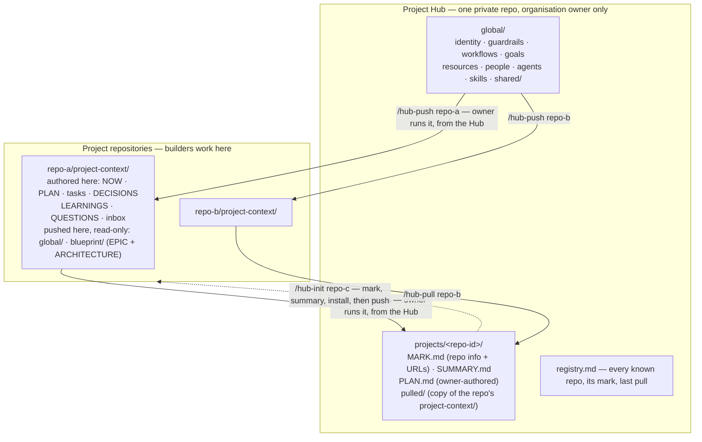

# Project Context and Project Hub — review of `strategy` and a design proposal

Status: proposal, written 2026-09-02 against `strategy` at `083572d` (0.6.0).
Revised four times on 2026-09-03. The third revision replaced Parts 2 to 4
wholesale: Daren gave a deterministic direction splitting the work into **two
affiliated products**, Project Context in each project repository and Project
Hub as the organisation leader's private repository. That withdrew the per-user
vault, the repo-to-vault mirror, branch mirrors, the `OWNERS.md` approval gate,
and the `local`/`personal`/`team` placement continuum introduced by the first
two revisions of the day. The fourth revision, the current one, records Daren's
answers to D10 and D11 and one further instruction: there is **no global
distribution repository** — the owner pushes with `/hub-push`, so builders hold
no permission on the Hub at all and the builder's product touches no network;
the plan exists at **two altitudes**, `blueprint/EPIC.md` authored by the owner in the
Hub and `PLAN.md` authored by builders in the repo, with `PLAN.md` required to
conform to it, and `ARCHITECTURE.md` likewise moving to the Hub and arriving in
each repo's `blueprint/`; and install now writes the managed block into **both**
`CLAUDE.md` and `AGENTS.md`. Part 1, the review of the branch, is unchanged and
still accurate. The names stay Project Context and, for the second product, Project
Hub.
Author: Claude (taking over from the Codex session recorded in
`docs/context-hub-handoff.md`).
Lives in `planning/` because `docs/` is the GitHub Pages deploy root. Mirrored
to the Notion page where Daren reviews it and answers the open decisions.
Terms: *v1* is the first release of the two-product design (Part 4, slices 1 to
7); *v2* is what follows once v1 has been used and measured (slice 8 and
anything marked v2). *Builder* is a collaborator working in a project
repository; *owner* is the organisation leader who administers the Hub.

This document has three parts: what is actually on the branch and how well it
holds up; how the product is shaped to satisfy the seven principles for the
next, more versatile and operable Project Context; and a sequenced set of next
slices with the decisions only Daren can make.

The seven principles, as stated on 2026-09-02:

1. Three installation and operation modes: minimal local (in repo or
   gitignored; solo; continuity across sessions and agents); multi-project
   single user (private repo(s) plus an Obsidian vault scaffold); multi-project
   multi user (the same, plus governance).
2. Two-tier knowledge: global (workflows, users, agents, skills, identity,
   guardrails, resources, goals) and per project (plan, tasks, commits, NOW,
   decisions, learnings, architecture). Load only what is needed.
3. Coding sessions, pull requests, tickets, reviews, and docs keep their
   provenance, authorship, and history.
4. Engineers and agents retrieve relevant, verified knowledge before they plan,
   implement, or review.
5. Four interactions: capture (with a hook), discuss, govern, reuse and evolve.
6. Size guard: less is better; lean context always.
7. Born local, shared by choice.

Amendment, 2026-09-03, to principle 1: the three modes are not three
configurations of one installable. Minimal local is Project Context alone in a
repository with no Hub; multi-project single user and multi-project multi user
are Project Context in each repository plus one Project Hub, differing only in
how many builders the owner has. The Hub is a Git repository; Obsidian is an
optional viewer and authoring layer on it, never a requirement (2.3).

---

## Part 1 — Review of the `strategy` branch

### 1.1 What is on the branch (verified)

Corrected 2026-09-03 after a fetch. `origin/main` is at `ec5db82`, one commit
behind `strategy`; the only commit missing from `main` is the Context Hub
(`083572d`). The local clone's `main` had not been fetched and still showed
`cf19519`, which is where the 2026-09-02 count of 21 commits came from.

| Branch | Commits past `origin/main` | Content |
| --- | ---: | --- |
| `strategy` | 1 | 0.6.0 (Context Hub). 0.5.0 (single-command install, one-skill install, evidence anchors, triggers/ack, registry indexes) and the website source/build split with the Phase 0–1 docs pages are already on `main` |
| `feat/project-context-update-skill` | 2, forked at `cf19519` | a `project-context-update` skill (325-line script) plus README and guide edits |
| `docs/readme-onboarding-rewrite` | 1, forked at `cf19519` | a leftover; its README is byte-identical to pull request 4 on `strategy`, safe to delete |

The update skill is not on `strategy`, and the feature branch has none of
0.5.0/0.6.0.

The Context Hub arrived as one squashed commit (`083572d`, 47 files, 6,103
insertions). Its handoff header is stale: it names a `codex/context-hub-no-db`
branch and "uncommitted working-tree changes", but the work is committed on
`strategy` and the tree is clean.

Validation re-run locally on Python 3.13.9:

| Check | Result |
| --- | --- |
| `python3 -m unittest discover -s tests` | 72 passed |
| `python3 scripts/validate_repository.py` | 85 required files present |
| `python3 scripts/build_site.py --check` | 6 pages build |

The handoff's "not completed" list still stands: no wheel build was attempted,
no real Graphify extraction, no real team onboarding, no Windows write backend.

### 1.2 What is good and should survive the redesign

- **The authority ladder.** Primary artifacts > curated files (`NOW`,
  `DECISIONS`, `LEARNINGS`) > candidate knowledge > derived views. It is applied
  consistently across README, skills, templates, and doctor. Keep it verbatim.
- **Provenance that is real, not decorative.** `asserted_by` / `recorded_by` /
  `approved_by`, SHA-256 of captured bytes, content-addressed receipts, portable
  `repo:<binding>:<path>@<commit>` references, and bitemporal facts
  (`valid_at` / `invalid_at` / `recorded_at`). This is the strongest part of
  the hub and maps directly onto principle 3.
- **Hard / curated / soft metadata as a concept.** Mechanical vs. judged vs.
  generated fields is the right distinction. The *file format* that expresses it
  is too heavy (see 1.3), but the distinction should live on in the doctor.
- **Safety engineering.** Create-only plans, one managed block per instruction
  file, symlink and non-UTF-8 refusal, no-follow directory-descriptor writes
  tested against a parent swap, fail-closed on Windows. The embedded doctor's
  `no-delivery-path` check (context intact but nothing loads it) is a genuinely
  original idea and should stay a headline feature.
- **The trigger gate.** `context_triggers.py` detects "work landed since context
  was last touched", nags once per session, and accepts an honest `ack` bound to
  the commit it evaluated. That is the seed of the capture hook.
- **Zero runtime dependencies, deterministic dry-run/apply, idempotent
  re-runs.** These are the product's credibility and the site's whole pitch.
- **The website discipline.** Shared assets, i18n drift as a build error,
  generated `site/` never committed. Solid. The docs pages describe the current
  embedded/hub split, so the reference pages (site Phase 2) are cheaper to write
  once after the record model is unified.

### 1.3 Findings that block the seven principles

Ordered by how much they shape the redesign.

**F1. Two products, not one.** Embedded mode (`project-context/`, skill
`project-context`, `TEMPLATE_VERSION 0.5.0`, marker `project-context:start`,
IDs `D-001`) and Hub mode (skill `context-hub`, `SCAFFOLD_VERSION 0.1.0`,
schema `context-hub/1`, marker `context-hub:start`, IDs `rel-…`) are separate
code paths with separate templates, two doctors (16 vs. 37 check codes), and
NOW/DECISIONS/LEARNINGS templates that already differ (the hub versions add
attribution lines the embedded ones lack). "Linked" mode is hub mode with a
binding. There is no path from solo-embedded to team-hub that keeps record
formats. This is the direct obstacle to principles 1 and 7.

*Note, 2026-09-03:* the two-product direction does not contradict this finding.
F1 is about two incompatible **record models**, not about two deployment
surfaces. The redesign keeps one schema, one doctor, one CLI, and one version
number, and ships them as two installables with two audiences. See 2.0.

**F2. Record weight contradicts the size guard.** Every hub record carries
three metadata blocks and roughly 25 frontmatter lines, many required but empty
(`generated_at:`, `generated_by:`, `confidence:`, `aliases: []`,
`supersedes: []`, `superseded_by: []`). The schemas mark everything required, so
the deliberately small frontmatter parser must police fields that carry no
information. Agents pay those tokens on every L2 read; humans see noise in
Obsidian.

**F3. Raw transcripts in the durable repository.** `hub ingest` stores the
byte-exact payload *and* embeds the text again in the episode. The handoff
measured 23.4 MiB and roughly 2.5 M tokens for 1,000 synthetic episodes. Git
cannot purge committed history, so the current default makes an honest purge
impossible. The handoff's own two-plane recommendation is right and unbuilt; the
simpler fix is to keep sessions local by default (Part 2).

**F4. Capture is pull, not push.** Capturing anything into the hub means a
person or agent running `hub ingest` with seven flags at some later time. The
embedded trigger hook only reports that context is behind; it captures nothing,
and it is wired for one harness (`.claude/settings.json`). Principle 5.1 asks
for capture where the work happens.

**F5. Entities and relationships are unproduced structure.** No command creates
an entity, relationship, or insight; only templates, doctor validation, and
index generation exist. The 12 hub tests exercise safety and ingestion, not
record lifecycle, because there is no lifecycle command to test. The bitemporal
graph is elegant, but for the solo-continuity case it is weight without a user.

**F6. No "discuss" primitive.** Principle 5.2 needs open questions, assumptions,
and accepted answers. Nothing models a question. The nearest thing is an insight
in `candidate` state.

**F7. Governance is metadata without workflow.** `approved_by` fields exist; no
command approves, supersedes, rejects, or corrects, and nothing lists what is
waiting for a human. Ownership is a free-text line in `PROJECT.md`. The doctor
checks shapes, not that an agent has not approved its own assertion.

**F8. Retrieval is a reading order, not retrieval.** "Read SUMMARY, then NOW,
then grep DECISIONS/LEARNINGS." The registry index helps in embedded mode and
`indexes/*.md` helps in the hub, but there is no task-scoped query, no
path-aware matching, and the token budgets in the handoff (150–250 / 600–1,000
/ 4,000) are proposals nothing enforces.

**F9. The global tier does not exist.** The hub has `actors/` and `shared/`
(cross-project entities/relationships/insights). Workflows, skills, guardrails,
goals, resources, and identity have no home. Embedded mode has no global tier
at all.

**F10. Provenance grammar stops at sessions and files.** Episode kinds are
sessions, daily logs, and documents. Evidence references support `episode:`,
`repo:`, `file:`, `url:`. Pull requests, tickets, reviews, and commits (all named
in principles 2 and 3) have no reference shape, and the CLI cannot even emit the
schema's `human-note`, `meeting`, `import`, or `correction` kinds, set
`corrects`, or choose a classification other than `internal`.

**F11. Three version numbers.** Package 0.6.0, embedded `TEMPLATE_VERSION`
0.5.0, hub `SCAFFOLD_VERSION` 0.1.0. Consumer repositories pin the version they
installed (see the one-way-flow rule), so unifying the two modes is an upgrade
event for every installed repo and needs an upgrade command, not a
find-and-replace.

**F12. Branch hygiene.** `main` is one commit (0.6.0) behind; a leftover remote
branch duplicates pull request 4; the update skill lives on a branch nobody
merged; the handoff header is stale. None of this is hard, but it should be
settled before more work lands.

### 1.4 Answers to the handoff's reviewer checklist

| Question from the handoff | Answer |
| --- | --- |
| Is the durable-vs-purgeable two-plane model worth the complexity? | Yes in spirit, no in form. Do not commit raw sessions to the shared repo at all by default; keep them local and promote *capsules*. That gives the purge property without a second repository. |
| Artifacts first-class from day one, or only when promoted? | Only when promoted. A pinned reference plus digest plus retention class is enough. |
| Minimum provenance that survives a purge? | who (actor), when (occurred/captured), where (`binding@commit`), what (kind, hash), and the capsule text. Never the transcript. |
| Is governed skill evolution in scope? | Yes, as a global-tier record (`skill` with version, owner, linked learnings and failures) reviewed like any other change. Not the six-record experiment framework in v1. |
| Are active/cold routing and the token budgets appropriate? | Yes, but make the budgets enforced by an assembler and checked by the doctor, or they are documentation. |
| Is optional local SQLite FTS the right acceleration boundary? | Yes, later. Sharded per-project Markdown indexes first; SQLite only when measured. Agree with the handoff. |
| Does any feature create a false privacy or purge claim? | One: raw sources committed by default while the docs speak of "retention review before commit". Fix by changing the default, not the docs. |
| Highest-value next slice? | Unify the two protocols into one record model, then the sync, then capture, then retrieval. Not artifacts, archive, or evolution. |

---
## Part 2 — Design: two products, one record model

Superseded on 2026-09-03 by Daren's direction. Everything in this part that
described a per-user vault, a repo-to-vault mirror, branch mirrors, the
`OWNERS.md` approval gate, and the `local`/`personal`/`team` placement
continuum is withdrawn. What follows replaces it. Part 1 stands unchanged; F1
is reconciled in 2.0.

### 2.0 The thesis in one paragraph

There are two affiliated products that share one record model, one doctor, and
one version number. **Project Context** is installed in a project repository
and serves the people building that project; its records live in that
repository and it never writes outside it. **Project Hub** is a single private
repository owned by the organisation's leader; it is the authoring home of the
global tier and it holds a folder per project. Every movement between them is
initiated from the side that holds the right, and that side is almost always
the Hub: the owner pushes the global tier, the epic, and the blueprint down
into a repo with `/hub-push <repo>`, and pulls a project's records up with
`/hub-pull <repo>`. In the repository, `/projectcontext-update` reconciles what
arrived and touches no network at all. Nothing in a project repository ever
reaches the Hub, and the Hub is never readable or writable by builders — under
D10(b) they hold no permission on it whatsoever. Sessions stay local and are distilled into
capsules; no shared repository holds transcripts.

**Reconciling F1.** Part 1's finding F1 said "two products, not one" and called
it the obstacle to principles 1 and 7. That finding was about two *incompatible
record models* — two template sets, two doctors (16 vs. 37 check codes), two
markers, two schema strings, two version numbers, and no upgrade path between
them. It was never an argument against two deployment surfaces. The split below
is a **role split, not a format split**: one `project-context/1` schema, one
doctor, one CLI, one version, deployed as two installables. F1's remedy stands
in full; only its framing changes.

### 2.1 Architecture at a glance



**There is no global distribution repository (D10, resolved (b)).** Builders
need no permission of any kind on the Hub, not even read. Global content
reaches a repository because the owner puts it there with `/hub-push`, and
`/projectcontext-update` then works entirely inside the repository.

**Two rights, two directions, both pulls.**

| Who | Where they stand | Command | Moves | Requires |
| --- | --- | --- | --- | --- |
| Builder | Inside a project repo | `/projectcontext-init` | Installs Project Context into this repo | Write on that repo |
| Builder | Inside a project repo | `/projectcontext-update` | Reconciles the pushed set, refreshes the managed blocks in `CLAUDE.md` and `AGENTS.md`, carries the scaffold forward | Nothing. Local only, no network |
| Owner | Inside the Hub | `/hub-pull <repo>` | That repo's authored records → `projects/<id>/pulled/` | Read on that repo |
| Owner | Inside the Hub | `/hub-push <repo>` | Hub `global/` and `blueprint/` (which holds `EPIC.md` and `ARCHITECTURE.md`) → that repo's `project-context/` | Write on that repo |
| Owner | Inside the Hub | `/hub-init <repo>` | Creates `projects/<id>/` with a mark and an initial summary, installs Project Context into the repo, then pushes | Write on that repo |

The asymmetry is the point. A builder's tooling has no credential for the Hub
and no command that writes to it. The owner's tooling has credentials for the
repos because the owner already administers them. Neither product needs a
permission model of its own: the Git host's repository permissions are the
whole governance story, which is what makes this work on GitHub Free where
`CODEOWNERS`, protected branches, and required reviewers are unavailable on
private repositories.

### 2.2 Product 1 — Project Context (the repo side)

Authority for one project's context. Installed by `/projectcontext-init`, or by
the Hub owner through `/hub-init`.

| File or folder | Holds | Notes |
| --- | --- | --- |
| `SUMMARY.md` | L0 route, ≤150 words | Always loaded when the project is active. |
| `NOW.md` | Current state, active work, blockers, next action | Kept as is; the best-designed file in the product. |
| `PLAN.md` | The project-level plan: the milestone in front of the builders | **Authored here.** Must conform to `blueprint/EPIC.md` when one is present (2.4). |
| `blueprint/` | `EPIC.md`, the high-level plan, and `ARCHITECTURE.md`, plus any later owner-authored design records | **Pushed, read-only.** Authored by the owner in the Hub. `PLAN.md` conforms to `blueprint/EPIC.md`. |
| `tasks/` | One file per task: plan, progress, validation, outcome | Existing full-profile template plus provenance lines. |
| `DECISIONS.md`, `decisions/` | Constraining choices; registry plus detail records | Kept. |
| `LEARNINGS.md` | Verified reusable lessons | Kept. |
| `QUESTIONS.md`, `questions/` | Open questions, assumptions, accepted answers | The discuss primitive (2.6). |
| `inbox/` | Unpromoted capture capsules | The candidate state. |
| `indexes/` | Derived, regenerated, checked by the doctor | Includes the commit/PR map. |
| `global/` | The global snapshot, with a stamp | **Pushed, read-only.** Edited only in the Hub. The doctor flags a hand edit. |
| `sessions/` | Transcripts, when retained at all | Excluded from Git. Never leaves the machine. |
| `.project-context.json` | Marker: schema, version, project id, pushed-set stamps, install origin | One marker for both products. |

**The authored set and the pushed set.** Everything above is one of two things.
The **authored set** — `SUMMARY`, `NOW`, `PLAN`, `tasks/`, `DECISIONS`,
`LEARNINGS`, `QUESTIONS`, `inbox/`, `indexes/` — is written by builders in the
repository and is what `/hub-pull` collects. The **pushed set** — `global/`,
`EPIC.md`, `blueprint/` — is written by the owner in the Hub and arrives by
`/hub-push`. The pushed set is read-only to builders: the doctor errors when a
pushed file's hash no longer matches its stamp, and names the Hub as the place
to change it. A builder who disagrees with a pushed record files a question or
a `proposal` capsule, which reaches the owner at the next `/hub-pull` (2.4).
That single split is what makes the permission model trivial — builders can
write everything they are allowed to write, and nothing they are not.

**`/projectcontext-init`.** Onboards a repository: the onboarding question,
classification, consolidation review, profile, create-only apply, the protocol
skill, the instruction blocks below, harness hooks on opt-in, then the doctor.
It records the project id and writes the marker. It records that the pushed set
is absent, and the doctor says so rather than failing — a repository with no
Hub is a complete product (2.8). It never contacts the Hub and never announces
itself to the Hub: the Hub learns about repos from the owner, not the reverse.

**Instruction blocks in `CLAUDE.md` and `AGENTS.md`.** Install ensures **both**
root instruction files carry the managed `project-context` block, creating
whichever is missing. Today's installer updates every instruction file it finds
but creates only `AGENTS.md` when none exists, so a Claude-only repository ends
up with rules no Claude session reads; that is the gap this closes. The block
is delimited by `<!-- project-context:start -->` and `<!-- project-context:end -->`,
nothing outside the markers is ever touched, and re-running is idempotent. Its
text gains the two rules the split introduces: read `blueprint/EPIC.md` and
`blueprint/ARCHITECTURE.md` before planning, and never edit the pushed set —
file a question or a `proposal` capsule instead. The doctor's existing
`no-delivery-path` check is tightened from "some instruction file carries the
block" to naming which of the two is missing. (Today the check is
`missing-instruction-block` and it is satisfied by *either* file; it becomes one
finding per missing file.)

Both files get the **same** block. The protocol is harness-neutral, so there is
one text, and the existing "one skill text, installed once, thin harness
pointers" rule applies. Anything harness-specific a repository already keeps in
`CLAUDE.md` or `AGENTS.md` sits outside the markers and is never read or
written by the tool. The block is loaded into every session in that repository,
so it is held to the L0 budget and says what to *do*, never what the product
*is*:

```markdown
<!-- project-context:start -->
## Project Context

Before substantial work, run `project-context context --task "<one line>"`, or
read `project-context/NOW.md` and `project-context/PLAN.md` if the CLI is not
available. Search `DECISIONS.md`, `LEARNINGS.md`, and `QUESTIONS.md` for
constraints that touch the files you are about to change.

When planning, read `project-context/blueprint/` first: `EPIC.md` is the goal
this project serves, `ARCHITECTURE.md` is the shape it has to keep. Every
`PLAN.md` item names the epic item it serves.

`project-context/global/` and `project-context/blueprint/` are owner-authored
and read-only here. Do not edit them. To change one, run `project-context
capture --kind proposal` or file the question in `QUESTIONS.md`; it reaches the
owner on their next pull.

Record decisions, learnings, and questions as they happen with `project-context
capture`. Confirm important claims against the repository's primary artifacts.
Treat generated indexes and wikis as auxiliary views, not authority.
<!-- project-context:end -->
```

Against today's block, what is added is the retrieval command, the blueprint
read and the `Serves:` rule, and the read-only boundary with its escape hatch;
what is dropped is the pointer to `project-context/SKILL.md`, because the packet
now carries what the agent needs. A repository with no Hub simply has no
`blueprint/` and no `global/`, and those two paragraphs are inert rather than
wrong — which is why the block is one text in both products' installs.

**`/projectcontext-update`.** Under D10(b) this command never touches the
network. It reconciles what `/hub-push` left in the working tree: it verifies
the pushed set against its stamps, refreshes the managed blocks in `CLAUDE.md`
and `AGENTS.md`, carries the scaffold forward when the installed version is
older than the one it ships with — upgrading managed blocks and leaving every
record byte-for-byte — regenerates `indexes/`, and runs the doctor. It is still
pull-only in the sense that matters: it consumes, and it emits nothing. It
makes one mechanical commit scoped to the paths it wrote, carrying a
`Context-Update:` trailer, and it never pushes to a remote.

**Triggers.** Each one calls the same command and no-ops when the stamp is
current.

| Trigger | Does |
| --- | --- |
| `/projectcontext-init` | One update at the end of the install |
| SessionStart (harness hook) | `update` when a pushed stamp does not match, then the context packet (2.5) |
| Fresh clone, or a branch that just took a `/hub-push` commit | The same SessionStart path catches it |
| Stop (harness hook) | The trigger gate and the `capture` offer; no update |
| `/projectcontext-update` | Any time, by hand |

### 2.3 Product 2 — Project Hub (the owner side)

One private repository, administered by the organisation's leader. It has two
jobs: it is the authority for the global tier, and it is the leader's view of
every project.

```text
project-hub/
  global/                     authority for the global tier
    SUMMARY.md  IDENTITY.md  GUARDRAILS.md  WORKFLOWS.md
    GOALS.md  RESOURCES.md
    people/  agents/  skills/  shared/
  projects/
    <repo-id>/
      MARK.md                 repo basic info and URLs; the identity of the project
      SUMMARY.md              the owner's summary of the repo
      blueprint/              authored here, pushed down whole
        EPIC.md               the high-level plan for the project
        ARCHITECTURE.md       the shape the code cannot express
      pulled/                 verbatim copy of the repo's authored set, stamped
  registry.md                 every known repo, its mark, and its last pull
  .project-hub.json           marker: schema, version, distribution target
```

**`MARK.md`** is the mark Daren asked for: the repo's basic information and
URLs — remote URL, default branch, host, visibility, the project id, the
builders the owner knows about, and links to the issue tracker, CI, and any
deployment. It is what lets the Hub address a repo without a checkout, and it
is the one file in `projects/<id>/` that `/hub-init` always writes.

**`/hub-init <repo>`** is the onboarding command for a repository that has no
Project Context yet. It does four things, in order, and stops at the first
failure:

1. Reads the repo (clone or existing working copy) and writes
   `projects/<id>/MARK.md` from what it finds — remote, default branch,
   visibility, languages, entry points.
2. Writes `projects/<id>/SUMMARY.md`, the initial summary of the repo: what it
   is, its shape, its state. This is a generated first draft the owner edits.
3. Installs Project Context into the repo — the same create-only apply
   `/projectcontext-init` performs, including the `CLAUDE.md` and `AGENTS.md`
   blocks.
4. Runs `/hub-push` for that repo, so the repository starts with the pushed set.
5. Records the repo in `registry.md`.

Steps 3 and 4 write to someone else's repository. Both go through the single
gated write path described under `/hub-push`. `/hub-init` is refused outright
when the marker says Project Context is already installed; `/hub-push` is the
right command then.

**`/hub-push <repo>`** is how everything the owner authors reaches the
builders, and it is the resolution of D10: option (b), no distribution
repository, no builder permission on the Hub at all. It copies the Hub's
`global/` shareable subset and `projects/<id>/blueprint/` into that repo's
`project-context/`, stamps each
with the Hub commit and time, and refuses a subset that breaks the global
budget, naming the file to trim. `--all` pushes to every repo in the registry,
which is the command the owner runs after editing a guardrail.

Being the one write path in either product, it is gated the same way every
time: it works on a branch, never on the default branch; it never force-pushes;
it prints the diff and asks before the push; and it writes only inside
`project-context/`, plus the managed blocks in `CLAUDE.md` and `AGENTS.md`. The
"never create a remote, push, or invite" boundary is narrowed rather than
dropped — the Hub owner may push a branch to a repository they already
administer, and nothing else. Merging that branch stays a human act.

**The cost of (b), stated plainly.** Every global change means touching every
repository: `/hub-push --all` makes it one command, but it is N branches and N
merges, and a repo whose owner has not pushed lately is quietly stale. The
doctor reports the stamp age so "quietly" is the wrong word in practice. What
is bought for that price is the property Daren asked for literally — builders
hold no permission on the Hub, not even read — and a repository that needs no
network at all to work.

**`/hub-pull <repo>`** copies that repo's authored set into
`projects/<id>/pulled/`, minus `sessions/`, machine state, and the pushed set
it sent there in the first place, and stamps it with repository, branch, commit, and
time. It reads the default branch unless told otherwise (D7). It refreshes
`SUMMARY.md`'s state line and `registry.md`'s last-pull line. It is read-only
against the repo: it clones or fetches, it never writes there. `--all` pulls
every repo in the registry, which is the command the owner runs to catch up.

**Authoring in the Hub.** The owner edits `global/` and `blueprint/` in the Hub — in any editor, in Obsidian, or with an agent opened
on the Hub folder, which the managed instruction block makes protocol-aware.
The Hub's doctor runs before a push, so an over-budget guardrail is refused
before it can propagate to a single repository.

**Obsidian is optional.** The Hub is a Git repository. Obsidian is one viewer
and one authoring surface on it, and nothing in the pulls, the stamps, the
packet, or the doctor depends on it. Generated records use standard relative
Markdown links so they render on GitHub and in any editor; hand-written
wikilinks are accepted; the doctor resolves both. Hub init writes Obsidian
settings only with `--obsidian` or when an `.obsidian/` folder already exists.

### 2.4 Two authorities, and the one place they overlap

| Tier | Authored in | Derived copy | Direction |
| --- | --- | --- | --- |
| Global: identity, guardrails, workflows, goals, resources, people, agents, skills, shared records | Hub `global/` | `project-context/global/` in each repo, stamped | Hub → repo, by owner push |
| The project's design: `EPIC.md`, `ARCHITECTURE.md`, later owner-authored records | Hub `projects/<id>/blueprint/` | `project-context/blueprint/`, stamped | Hub → repo, by owner push |
| Project: SUMMARY, NOW, PLAN, tasks, decisions, learnings, questions, inbox, indexes | Repo `project-context/` | Hub `projects/<id>/pulled/`, stamped | Repo → Hub, by owner pull |
| The owner's view of a project: mark, summary | Hub `projects/<id>/` | None | None |
| Sessions and machine state | Local only | Never copied | None |

**Two plans at two altitudes, and one conforms to the other (D11).**
`blueprint/EPIC.md` is the high-level plan, authored by the owner in the Hub and
pushed down inside `blueprint/` alongside `ARCHITECTURE.md`.
`PLAN.md` is the project-level plan, authored by builders in the repository.
They are not the same record at two altitudes by accident: the epic says what
the project is for and what must be true when it is done, the plan says what
this milestone does about it.

"Conforms" is a checked relation, not an exhortation. `PLAN.md` carries a
`Serves:` line per milestone item naming the `blueprint/EPIC.md` item it
advances, and
the doctor enforces the pair:

| Condition | Doctor |
| --- | --- |
| A `PLAN.md` item names no epic item, and a `blueprint/EPIC.md` is present | Error: the plan has work the epic does not ask for. Either anchor it or raise a question. |
| A `blueprint/EPIC.md` item no plan item names | Warning, listed by `review`: the epic has an unserved goal. Not an error — an epic legitimately runs ahead of the current milestone. |
| A `Serves:` line names an epic item that does not exist | Error, and the likely cause is a pushed epic that superseded the one the plan was written against |
| No `blueprint/` is present | Nothing. A repository with no Hub has no epic, and `PLAN.md` stands alone (2.8). |

The assembler leads the `plan`-mode packet with the whole of `blueprint/`, so the constraint is in front of whoever writes
the plan rather than checked after the fact.

**Architecture moved authorship, and that is the real change.** The superseded
design had builders author `ARCHITECTURE.md` in the repo. It is now written by
the owner in the Hub and pushed into `blueprint/`. The gain is that one person
holds the shape of the system across projects. The cost is that builders
discover architectural facts while building and can no longer write them down
where they found them — so the feedback channel below is not a nicety here, it
is load-bearing.

**One authority per copy.** The doctor flags an edit to a copy whose hash no
longer matches its stamp and names where the change belongs: the Hub for
`global/` and `blueprint/`; the repo for `projects/<id>/pulled/`.

**No write-back path, by design.** A builder who wants to change a guardrail, an
epic item, or an architecture record cannot edit the pushed file; the doctor
will say so and name the Hub. They file a question or a `proposal` capsule in
their own repo, and it reaches the owner at the next `/hub-pull`, which is why
the Hub pulls `inbox/` and `questions/` along with everything else. That is the
feedback channel: it costs no permission, no fork, and no pull request against
the Hub, and it arrives with the project context that explains it. Its one weak
point is latency — nothing moves until the owner pulls — so `review` on the Hub
sorts by oldest unanswered, and `/hub-pull --all` is the owner's routine.

### 2.5 Retrieve before work (principle 4)

Unchanged in substance from the superseded design; only the source of the
global tier differs.

```text
project-context context --task "<one line>" [--files a,b,...] [--mode plan|implement|review] [--budget 4000]
```

Assembled in order until the budget is spent:

1. Global L0, `IDENTITY.md`, `GUARDRAILS.md` from the pushed snapshot (always;
   they are small by rule).
2. `blueprint/EPIC.md`, and in `plan` and `review` modes
   `blueprint/ARCHITECTURE.md` — the owner's constraints, ahead of the
   builders' own records.
3. Project `NOW.md` and the active items of `PLAN.md` from the repo's live
   `project-context/`.
4. Decisions, learnings, and questions whose **evidence anchors share a path
   prefix with the task's files**. Cheap, deterministic, no embeddings.
5. The same record types matched by topic tokens in the task line.
6. Skills whose applicability matches the mode or paths, and `shared/` records
   from the snapshot.
7. Anything left over becomes links, not text.

The old step 6 of the superseded design — reading other projects' mirrors from the
vault — is gone on the repo side. A builder's packet sees only this project and
the global snapshot, which is the correct blast radius: the builder has no
right to another project's context. The Hub has its own assembler for the owner,
which may read across `projects/`, and that is where cross-project reuse now
lives.

"Verified" means only `accepted` / `approved` records are included by default;
proposed items appear in a separately labelled short section or are omitted with
`--verified-only`. Every item carries its path and commit.

Wiring: a `SessionStart` hook in Claude Code emits the packet as additional
context. For Codex, Cursor, and others, the managed instruction block tells the
agent to run the command first. `--mode review --diff` is the same assembler fed
by changed paths.

Later, when measured: sharded per-project indexes and optional SQLite FTS. Not
before.

### 2.6 Provenance, capture, discuss, evolve

**Provenance (principle 3)** is unchanged: the attribution triple, hashes,
receipts, `path@commit` anchors, supersession links, and one reference grammar
the doctor validates by shape:

```text
session:<harness>:<id>          commit:<binding>:<sha>
pr:<binding>#<number>           review:<binding>#<pr>/<comment-id>
ticket:<tracker>:<key>          doc:<binding>:<path>@<commit>
url:<https://...>               capsule:<id>
```

History is Git plus `supersedes` links, never stored lineage tables. Stamps are
provenance: every pulled copy and every snapshot records its source repository,
branch, commit, and time. Minimum provenance on every capsule: harness, model
when known, actor, session reference, `binding@HEAD`, captured-at. Correction,
not edit — supersede or add a correcting record, never rewrite meaning.

**Capture (principle 5.1).** A capsule is a small typed record, ≤200 words,
with full provenance:

```text
project-context capture --kind decision|learning|question|assumption|constraint|proposal \
  --text "..." [--evidence <ref> ...] [--files a,b]
```

It writes to `project-context/inbox/` and nothing else. The Claude Code `Stop`
gate is extended from "context is behind" to "context is behind; here are the
triggers; here is the capture command", once per session. `SessionEnd` writes a
session capsule if none was written. The managed block gives Codex and other
harnesses the same instruction. Transcripts, when retained, go to a local path
and never enter a shared repository; today's `hub ingest` becomes an explicit
promotion step that asks for a classification and a retention class.

**Discuss (principle 5.2).** `questions/Q-001.md` holds the question, context,
options, positions with attribution and evidence, the accepted answer with who
accepted it and when, and a status of `open`, `answered`, or `superseded`.
Assumptions are capsules that must be confirmed or refuted; the doctor warns
when one has stayed unconfirmed past a threshold. Before implementing an
ambiguous requirement an agent checks `QUESTIONS.md`, and files the question if
it is not there. Open questions reach the owner through `/hub-pull`.

**Govern (principle 5.3).** Governance is the Git host's repository
permissions, and nothing else. The Hub is private and owner-only, so no builder
can change a guardrail, a skill, an agent rule, or the owner list — not because
a gate refuses them but because they have no access. This is the answer to D3
that survives GitHub Free, and it deletes the entire mechanism the 2026-09-03
revision added: no `Context-Approved-By:` trailer (forgeable on someone else's
commit with signatures off, and not the owner's signature with them on), no
`sync pull` approval gate, no signature verification, no vault pull request
that is theatre when the proposer already has write. What survives:

- `OWNERS.md` in the Hub's `global/`, as a **record** naming who owns what, for
  humans and for `review`. Not enforcement.
- The doctor's **agent self-approval error**: `approved_by` may not equal
  `asserted_by` for an agent actor. This is a correctness check on records, not
  an access control, and it stays.
- Lifecycle vocabulary unified to `proposed → accepted → superseded | rejected`
  for decisions, learnings, and questions; `candidate → approved → superseded`
  is retired.
- `project-context review`, which lists what needs a human: unpromoted capsules,
  proposed records, questions open past N days, drifted evidence anchors,
  unconfirmed assumptions, stale `NOW.md`, stale snapshots. It prints to stdout.
- An optional `CODEOWNERS` file, written on request, with the doctor warning
  that the host may not enforce it.

**Reuse and evolve (principle 5.4).** Plans inherit constraints:
`project-context plan --milestone "<name>"` seeds `PLAN.md` with an "Inherited
constraints" section from the assembler. The `implement` packet leads with the
decisions whose anchors overlap the task's paths. `context --mode review --diff`
produces a precedent section. `project-context onboard` is a packet preset
(global L0, identity, workflows, this project's `NOW`). Skills evolve as
`global/skills/<name>.md` records with a version bump and `learned_from` links,
edited in the Hub by the owner and carried into every repo by the next update;
agents may propose skill changes and never approve, activate, or retire their
own.

### 2.7 Size guard (principle 6)

| Rule | Enforcement |
| --- | --- |
| Required frontmatter is at most 8 keys; everything else optional | Doctor validates required keys only |
| The three-block metadata format is retired | Field rules live in the doctor |
| L0 ≤ 150 words, `NOW.md` ≤ 400 words, capsule ≤ 200 words, packet ≤ 4,000 tokens | Warnings; errors under `--strict` for CI |
| The pushed set stays under the global budget | `/hub-push` refuses an over-budget subset and names the file to trim, before it reaches any repo |
| `blueprint/EPIC.md` ≤ 600 words; `blueprint/ARCHITECTURE.md` ≤ 1,200 | Warnings in the Hub; errors under `--strict` |
| Every `PLAN.md` item anchors to an epic item when an epic is present | Doctor error (2.4) |
| No transcripts in a shared repository or in a pulled copy | Doctor errors on a tracked `sessions/`; pull and push both exclude it |
| Both `CLAUDE.md` and `AGENTS.md` carry the managed block | Doctor's `no-delivery-path` check names the missing one |
| Registries beyond a size threshold must have a current index | Existing `--check` behaviour |
| `inbox/` beyond a threshold blocks the `Stop` gate once | Trigger script |
| One skill text, installed once, thin harness pointers | Existing discipline |

Entities and relationships become an optional extension (D4). In v1 the
knowledge graph is Markdown links plus evidence anchors; the doctor resolves
relative links and wikilinks alike.

### 2.8 Born local, shared by choice (principle 7)

The split changes what this principle means, and makes it easier to honour.

- A repository with Project Context installed and no pushed set is a complete,
  working, offline product: records, doctor, capture, packet, trigger gate, and
  a `PLAN.md` that stands alone because there is no epic to conform to. The Hub
  is not required to exist. This is the minimal local mode of principle 1, and
  it is now the default rather than a placement.
- The Hub is created deliberately by an owner who wants the aggregate. There is
  no lazy creation, no well-known path, and no machine-local vault. Nothing is
  created behind the user's back.
- **No command in the builder's product touches the network at all.** D10(b)
  removed the last one: `/projectcontext-update` reconciles what is already in
  the working tree.
- `/hub-push` is the only command in either product that writes to a repository
  it does not live in (`/hub-init` calls it), it shows the diff and asks first,
  and it works on a branch.
- `project-context doctor` reports `works offline: yes` when nothing the repo
  needs depends on a remote.

### 2.9 Skills and commands

| Skill | Product | What it does | CLI |
| --- | --- | --- | --- |
| `/projectcontext-init` | Repo | Onboards a repository: question, classification, consolidation review, profile, create-only apply, protocol skill, hooks on opt-in, doctor, one update. | `project-context init` |
| `/projectcontext-update` | Repo | Reconciles the pushed set against its stamps, refreshes the managed blocks in `CLAUDE.md` and `AGENTS.md`, carries the scaffold forward without rewriting records, regenerates indexes, runs the doctor. Local only; no network. | `project-context update` |
| `project-context` (protocol) | Repo and Hub | What an agent reads at session start: packet, work, capture, promote, ack, doctor. | `context`, `capture`, `review`, `doctor` |
| `/hub-init <repo>` | Hub | Writes the mark and the initial summary, installs Project Context into the repo, pushes the pushed set, registers the repo. Branch only, diff shown, confirmation required. | `project-hub init <repo>` |
| `/hub-push <repo>` | Hub | Sends `global/` and `blueprint/` into that repo's `project-context/`, stamped. `--all` for every registered repo. The one write path into a repository the Hub does not live in. | `project-hub push [repo]` |
| `/hub-pull <repo>` | Hub | Copies the repo's authored set into `projects/<id>/pulled/`, stamped; refreshes the summary state line and the registry. Read-only against the repo. `--all` for every registered repo. | `project-hub pull [repo]` |

**Naming.** Daren's names, 2026-09-03: `/projectcontext-init`,
`/projectcontext-update`, `/hub-init`, `/hub-pull`, and `/hub-push` added with
D10(b). Record filenames follow the existing uppercase convention, so Daren's
`epic.md`, `plan.md`, and `architecture.md` are written `blueprint/EPIC.md`,
`PLAN.md`, and `blueprint/ARCHITECTURE.md`. Both owner-authored project records
live in `blueprint/` together, so the pushed set is exactly two paths:
`global/` and `blueprint/`. They replace the
`/context-init`, `/context-vault-init`, `/context-sync`, `/context-upgrade` set
chosen on 2026-09-02. The protocol skill keeps the name `project-context`
because existing installs are discovered by it. `/context-upgrade` disappears
as a separate skill: upgrading is what `/projectcontext-update` does when the
scaffold it fetched is newer than the one installed.

---

## Part 3 — Naming, versions, and the upgrade path

The names stay Project Context and, for the second product, Project Hub. What
still changes:

- **One protocol, one namespace, two installables.** The `context-hub` skill's
  record machinery folds into the shared `project-context` protocol; the
  `<!-- context-hub:start -->` managed block and the `context-hub/1` schema
  string retire in favour of the `project-context` marker and a single
  `project-context/1` record schema. The hub commands (`init`, `add-actor`,
  `add-project`, `bind-project`, `ingest`, `index`, `doctor`) become the
  `project-hub` product's `init` and `pull` plus the shared doctor. Today's
  Context Hub — actors, episodes, entities, relationships — is the ancestor of
  Project Hub, but Project Hub is a much smaller thing: a global tier, a folder
  per project, and two pull commands.
- **One version number.** Retire `TEMPLATE_VERSION` and `SCAFFOLD_VERSION`; both
  markers record the package version they came from. The `VERSION` file and
  `pyproject.toml` already agree; make the scripts read from them.
- **Upgrade, not rewrite.** Consumer repositories never write back and pin the
  version they installed, so the upgrade path folded into
  `/projectcontext-update` must: detect an installed `project-context/` or a
  `context-hub` scaffold, rewrite only managed blocks, keep every record
  byte-for-byte, and run the doctor. Old hub markers keep being recognised for
  two releases so a half-upgraded install is diagnosed, not broken.
- **Site sequencing.** The docs pages describe today's embedded/hub split and
  are now wrong in a second way: they will need to describe two products with
  two audiences. Write the reference pages (site Phase 2) after the record model
  and the two pulls are in place, so they are written once.

---

## Part 4 — Slices and the decisions that gate them

*v1* is the first release of the two-product design: slices 1 to 7. *v2* is
what follows once v1 has been used and measured. Each slice is shippable on its
own and keeps the test suite green.

1. **Branch hygiene.** Local `main` fast-forwarded to `origin/main` (done
   2026-09-03); the `docs/context-hub-handoff.md` header refreshed (done
   2026-09-03); the `feat/project-context-update-skill` branch resolved — it
   conflicts with `strategy` in four files and its merge base is 20 commits
   back, and slice 2 rewrites the same files, so the recommendation is to defer
   it and re-apply the capability on the unified model; the leftover
   `origin/docs/readme-onboarding-rewrite` deleted once authorised; a decision
   on when `main` takes the Context Hub.
2. **One record model.** One template set, one doctor, one lifecycle vocabulary,
   one schema string, one version number, slim frontmatter down to the required
   core, and an upgrade from both the embedded and the hub scaffolds that
   rewrites no records. This is the unification commit and it is the gate for
   everything else.
3. **Project Context, standalone.** `/projectcontext-init` writing the record
   set and the marker; the managed blocks in **both** `CLAUDE.md` and
   `AGENTS.md`, creating whichever is missing, with the tightened
   `no-delivery-path` check; the doctor; `capture` into `inbox/`; the `Stop`
   gate extension; `SessionStart` emitting the packet. No Hub, no network. A
   complete product at the end of this slice.
4. **Project Hub, standalone.** The Hub scaffold, `global/`, `registry.md`,
   `MARK.md`, `blueprint/` with `EPIC.md` and `ARCHITECTURE.md`, and `/hub-pull` against a repo that
   already has Project Context. Read-only against repos. The owner can see every
   project at the end of this slice.
5. **`/hub-push` and the pushed set.** The one gated write path — branch, diff,
   confirmation, never the default branch, never a force-push — carrying
   `global/` and `blueprint/` into a repo with stamps and the budget
   refusal; `--all`; and `/projectcontext-update` reduced to the local
   reconcile, stamp check, block refresh, and scaffold upgrade.
6. **`/hub-init`.** The mark, the generated initial summary, the install, and a
   `/hub-push` to finish; refused when Project Context is already installed.
7. **Retrieval, conformance, and the global tier's content.** Path-anchor
   matching, topic matching, budgets, `--mode review --diff`; the epic-to-plan
   `Serves:` check; the `global/` files and templates; the shareable subset; the
   `onboard` preset; `QUESTIONS.md` and `review`.
8. **Later, when measured (v2):** the Hub's cross-project assembler, sharded
   indexes, a derived SQLite cache on the Hub side only (see below), Windows
   no-reparse writes, the entity/relationship extension, archive and purge,
   skills-as-records evolution.

**On SQLite (asked 2026-09-03, revisited the same day).** Keep it, on the Hub
side only, as a derived cache. The boundary is not about availability, and it
never was: `sqlite3` ships in the Python standard library, so the dependency
cost has always been zero. Two things decide it instead.

*Why not in a project repo.* The retrieval signal that matters is a path prefix
compared against evidence anchors; over one repository's records that is a scan
of a few hundred small files, and an index would be machinery guarding nothing.
Worse, a database file committed to `project-context/` would be the first thing
in the folder a human cannot read, diff, or review in a pull request — which is
the premise of the whole product. That objection stands whatever else is true.

*Why the Hub is different, and Daren's point sharpens this.* Daren notes that
Obsidian already brings SQLite into the vault picture. What is verifiable is
slightly narrower than "Obsidian bundles it": the SQLite story in Obsidian is a
community-plugin one — SQLite Explorer, SQLite DB, SQL Viewer and similar ship a
WASM SQLite engine and read `.sqlite` / `.db` files a user places in the vault.
Whether current Obsidian also keeps a SQLite store of its own for core caching
could not be confirmed here and is worth a link if the decision ever leans on
it. Either way the useful consequence holds: a `.db` file inside a Hub that is
also an Obsidian vault is an ordinary citizen of that environment, browsable
with an existing plugin, not an alien binary. That makes a Hub-side cache
cheaper and more legible than the earlier note implied — the Hub is where every
project is held at once, which is the only place scale can genuinely appear.

*Rules if it is ever built.* It is a regenerable cache and never a source of
truth; it is `.gitignore`d in the Hub, because a Git-tracked Hub that reindexes
would otherwise commit a large binary on every change; deleting it costs
nothing; and nothing in either product may require it to be present. The trigger
is a measurement, not a milestone: a Hub cross-project query slow enough to
notice. Note also that Obsidian's own indexing already gives the owner fast
interactive search across a vault, which is an argument for not building this
at all until an automated Hub query — not a human one — proves too slow.

### Decisions

**Resolved.**

- [x] **D1. Should raw sessions ever be committed to a shared repository by
  default?** No; capsules only, sessions local. Daren, 2026-09-02. Unaffected by
  the split and still in force.
- [x] **D2. Where does project knowledge live?** Superseded 2026-09-03 by the
  two-product direction. Project knowledge is authored in the project
  repository and copied into the Hub by the owner's `/hub-pull`. There is no
  per-user vault, no repo-to-vault mirror, and no placement continuum. The
  earlier hybrid answer of 2026-09-03 is withdrawn.
- [x] **D3. Governance enforcement.** Resolved structurally by the split: the
  Hub is a private repository the builders have no access to, so the Git host's
  repository permissions are the whole mechanism and they work on GitHub Free.
  The tool-enforced `OWNERS.md` gate, the `Context-Approved-By:` trailer, and
  signature verification are all deleted (2.6). `OWNERS.md` survives as a
  record; the agent self-approval error survives as a record check.
- [x] **D6. `sync --propose`.** Deleted rather than deferred. There is no
  repo-to-Hub push to propose against; a builder's feedback is a question or a
  `proposal` capsule in their own repo, which reaches the owner at the next
  `/hub-pull` (2.4).
- [x] **D8. Vault at first init versus lazy vault.** Moot: there is no vault.
  The Hub is created deliberately by an owner.
- [x] **D10. How do builders read the global tier when the Hub is closed to
  them?** Daren, 2026-09-03: **option (b)**, with a new `/hub-push [repo]`
  command. There is no global distribution repository. The owner pushes
  `global/` and `blueprint/` into each repo; builders hold no
  permission on the Hub, not even read; `/projectcontext-update` becomes a
  purely local reconcile and the builder's product stops touching the network
  entirely (2.2, 2.3). The accepted cost is that a global change is N branches
  and N merges, mitigated by `--all` and by the doctor reporting stamp age.
- [x] **D11. Is the project plan authored twice or once?** Daren, 2026-09-03:
  **two records at two altitudes, with a conformance relation.** `EPIC.md` is
  the high-level plan, authored by the owner in the Hub; `PLAN.md` is the
  project-level plan, authored by builders, and it must conform to the epic.
  `ARCHITECTURE.md` likewise moves to owner authorship in the Hub. Daren,
  same day: **both live in `blueprint/`**, so the owner-authored project design
  is one folder, pushed whole, and the pushed set is exactly `global/` plus
  `blueprint/`. Conformance is checked,
  not exhorted: a `Serves:` line per plan item, a doctor error for plan work no
  epic item asks for, a warning for epic items nothing serves (2.4).

**Open.**

| ID | Question | Recommendation |
| --- | --- | --- |
| D4 | Entities and relationships in v1 or an extension | Extension. Nothing in the two-product flow needs them. |
| D5 | Is the pushed set tracked in the repo or excluded | **Tracked**, and D10(b) settles it beyond argument: the push *is* a commit, so an excluded pushed set could not travel at all and no builder would ever see a guardrail. Kept small by the budget, which `/hub-push` enforces before sending. |
| D7 | Which branch does `/hub-pull` read | Default branch only. Per-branch copies are v2 if the owner ever needs work in progress. |
| D9 | Does `IDENTITY.md` ever reach a project repo | No for identity, yes for guardrails, the epic, and the blueprint. Identity is the owner's or the org's voice and defaults; it belongs in the owner's own packet, not committed into a repo that may have outside collaborators. |
